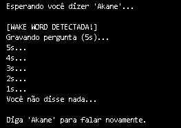

# Akane
Projeto de assistente virtual por voz em python com personalidade customizada

## Configuração inicial
O programa exige um arquivo .env com as APIs necessarias para o funcionamento do mesmo.

Caso o arquivo não exista na maquina do usuário ele ira pedir as chaves API do Groq(IA) e do ElevenLabs(Voz)


## Como usar
O projeto opera em um escutando o microfone do usuário continuamente. Ao ser executado, o sistema utiliza o PocketSphinx para monitorar o áudio local em busca da palavra-chave "Akane".

Assim que a wake word é detectada, a assistente escolhe saudação pré-gravada para confirmar que está ouvindo,
após isso o usuário um tempo de 5 segundos para fazer sua pergunta.

Após responder, a Akane volta a "dormir", aguardando ser chamada novamente.



### Personalização
Você pode customizar a assistente via codigo:

Duração da pergunta.
```
duration = 5 #<-- Altere o tempo de gravação da pergunta
```
Voce pode alterar a voz da assistente no campo "voice_id".
*IDs públicos recomendados:
    - Bella: hpp4J3VqNfWAUOO0d1Us
    - Laura: FGY2WhTYpPnrIDTdsKH5
    - Lily: pFZP5JQG7iQjIQuC4Bku
```
audio = client_eleven.text_to_speech.convert(
    text=chat_completion.choices[0].message.content,
    voice_id="C1HmuBQF5FgKhKffeOsL", #<-- Aqui você altera o modelo de voz ElevenLabs
    model_id="eleven_multilingual_v2",
    output_format="pcm_24000",
)
```
Você pode alterar a personalidade dela na linha "content" do bloco "system", e também pode alterar o modelo da IA em "model"(Atualmente usando llama-3.1-8b-instant)
```
def gerar_resposta(texto):
    chat_completion = client_groq.chat.completions.create(
        messages=[
            {
                "role": "system", 
                "content": " Você é uma assistente sarcástica chamada Akane. Responda com no máximo 30 palavras. Nunca use emojis." #<--Personalidade da assistente
            },
            
            {
                "role": "user",
                "content": texto
            }
        ],
        model="llama-3.1-8b-instant",
    )
```


### Bibliotecas usadas
* Captura e Processamento de Áudio:
    - pocketsphinx
    - sounddevice
    - playsound3

* Inteligência e Transcrição (IA)
    - faster_whisper
    - groq
    - elevenlabs

* Utilitários e Segurança
    - dotenv
    - os
    - random
    - time